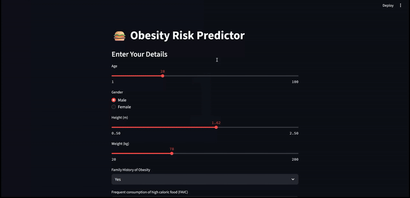

# 🍏 Obesity Risk Classification Project

A machine learning-powered web app to predict obesity levels based on lifestyle and demographic factors.

## ✨ Features
- **📊 Interactive Dashboard**: Real-time predictions with visual explanations
- **🤖 Multi-Model Comparison**: Logistic Regression, Random Forest, SVM, KNN
- **📱 Responsive Design**: Works on desktop and mobile
- **📈 Explainable AI**: SHAP values for model interpretability

## 🎥 App Demo

